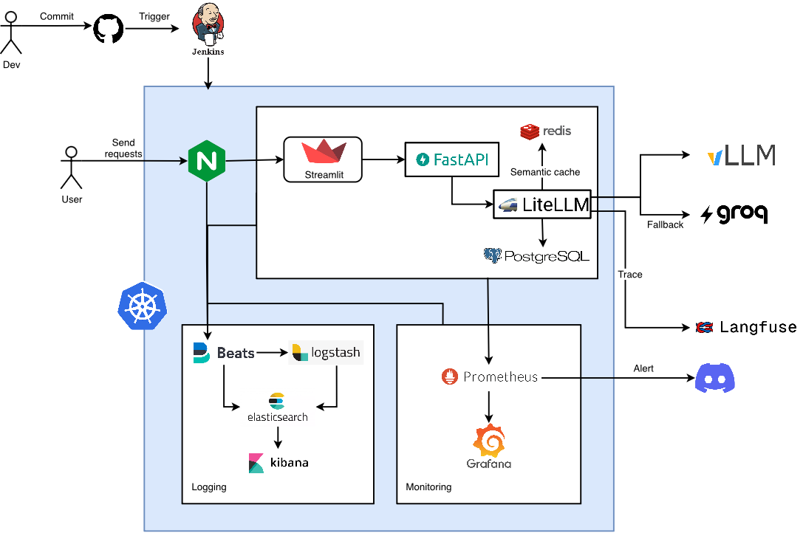

# Scientific Document Visual Question Answering (VQA) & Multimodal RAG System

A production-ready, enterprise-grade multimodal document understanding and Visual Question Answering (VQA) system built on modern Cloud-Native and MLOps architectures. Fully deployed on **Kubernetes (Minikube / Production Cluster)** using **Helm**, featuring an intelligent **LiteLLM Gateway**, **Qwen-VL / vLLM** vision-language model serving, **ColQwen2.5 & BM25 Hybrid Embedder Microservice**, **Qdrant Vector Database (MaxSim Multi-Vector, Neighbor Score Diffusion & Two-Tier Semantic Cache)**, **MinIO Object Storage**, full-stack observability with **Prometheus/Grafana/ELK (Elasticsearch, Logstash, Kibana, Filebeat)**, and an end-to-end automated **CI/CD pipeline with Jenkins**.

---

## Table of Contents

- [Architecture Overview](#architecture-overview)
  - [1. Ingress & Frontend Layer](#1-ingress--frontend-layer)
  - [2. Multimodal RAG & Embedder Layer](#2-multimodal-rag--embedder-layer)
  - [3. Backend & Storage Layer](#3-backend--storage-layer)
  - [4. AI Gateway & Model Serving Layer](#4-ai-gateway--model-serving-layer)
  - [5. Observability & Logging Layer](#5-observability--logging-layer)
  - [6. CI/CD Automation Pipeline](#6-cicd-automation-pipeline)
- [Project Structure](#project-structure)
- [Dataset & Schemas](#dataset--schemas)
  - [Viet-ComputerScience-VQA Dataset](#viet-computerscience-vqa-dataset)
  - [Chat Session Schema](#chat-session-schema)
  - [Message Schema](#message-schema)
  - [Storage & Semantic Caching Schema](#storage--semantic-caching-schema)
- [End-to-End Deployment Guide](#end-to-end-deployment-guide)
  - [1. Serve Embedder (GPU)](#1-serve-embedder-gpu)
  - [2. Serve Model with vLLM (GPU)](#2-serve-model-with-vllm-gpu)
  - [3. Ingest Scientific Documents into Qdrant](#3-ingest-scientific-documents-into-qdrant)
  - [4. Start & Deploy on Minikube (1-Click)](#4-start--deploy-on-minikube-1-click)
  - [5. Run Automated Tests](#5-run-automated-tests)
  - [6. Set Up Jenkins CI/CD](#6-set-up-jenkins-cicd)
  - [7. Access Observability & Dashboards](#7-access-observability--dashboards)

---

## Architecture Overview



### 1. Ingress & Frontend Layer
* **NGINX Ingress Controller**: Manages external routing into the Kubernetes cluster via `vqa.127.0.0.1.nip.io` or `vqa.local`. Configured with `proxy-body-size: 50m` to support high-resolution document uploads.
* **Streamlit Frontend (`:8501`)**: Interactive web UI supporting multi-image upload, multi-turn chat memory, and real-time Server-Sent Events (SSE) token streaming.

### 2. Multimodal RAG & Embedder Layer
* **ColQwen Embedder Microservice (`:8000`)**:
  * Standalone FastAPI service running `vidore/colqwen2.5-v0.2` and FastEmbed BM25.
  * Secured with optional `X-API-Key` authentication.
  * **`POST /embed`**: Specialized for user query embedding during chat retrieval.
  * **`POST /embed-images`**: Specialized for document batch ingestion from base64-encoded PDF page images.
* **Qdrant Hybrid Retrieval & Neighbor Diffusion**:
  * Executes dual prefetch: ColQwen Multi-Vector MaxSim (`limit=20`) + BM25 Sparse Vector (`limit=20`).
  * Fuses results via Reciprocal Rank Fusion (RRF).
  * **Neighbor Score Diffusion**: Propagates relevance scores to adjacent pages ($P-1$ with $\alpha_{backward}=0.05$ and $P+1$ with $\alpha_{forward}=0.30$) to capture cross-page continuity.
  * Returns Top-3 most relevant textbook pages (`top_k=3`).

### 3. Backend & Storage Layer
* **FastAPI Backend (`:8000`)**: Core business logic, deduplication engine, MinIO SDK integration, and async SQLAlchemy database operations.
* **Two-Tier Qdrant Semantic Caching Engine**:
  * **Anchor Image Hashing (`compute_image_hash`)**: Computes a SHA-256 hash over raw image bytes to ensure absolute cache isolation between distinct document figures and maintain context consistency across multi-turn dialogues.
  * **Tier 1 (Instant Exact Match, <1ms)**: Checks Qdrant payload index (`image_hash` + `query_normalized`) without requiring any vector compute.
  * **Tier 2 (ColQwen Semantic Match, ~10-20ms)**: Executes MaxSim multi-vector search (`using="colqwen"`, similarity threshold $\ge 0.80$) constrained strictly to the matching `image_hash`.
  * **Zero-Compute Short-Circuit**: Cache hits immediately return stored answers and retrieved textbook pages, completely bypassing RAG retrieval and GPU LLM generation.
* **Vision Token Budgeting Engine**:
  * Downscales all images to maximum 1280px (JPEG quality 85) to preserve vision token budget.
  * Automatically retains user-uploaded anchor figures while replacing ephemeral past RAG pages.
  * Enforces a hard cap of **maximum 4 images per prompt** to strictly adhere to vLLM's multi-modal limit.

### 4. AI Gateway & Model Serving Layer
* **LiteLLM Gateway (`:4000`)**: Centralized OpenAI-compatible proxy featuring:
  * **Primary Endpoint**: Routes vision requests to **vLLM** hosting `namkua/qwen3-vl-8b-merged-16bit-SciVQA` with 16-bit quantization, prefix caching, and `--limit-mm-per-prompt '{"image": 4}'`.
  * **Intelligent Fallback**: Automatic instant failover to **Groq Cloud Vision API** (`groq/qwen/qwen3.6-27b`) upon connection errors or timeout thresholds.
  * **Prompt Caching & Tracing**: Automatic prompt token caching and telemetry exported to **Langfuse Cloud**.

### 5. Observability & Logging Layer

* **Prometheus (`:9090`) & Grafana (`:3000`)**: Full-stack cluster and application telemetry monitoring:
  * **Kubernetes Infrastructure Metrics (cAdvisor / Kubelet / Node Exporter)**: Real-time CPU, RAM, and GPU memory utilization per pod (`backend`, `embedder`, `vllm`, `qdrant`, `litellm`), Network I/O (image payloads and Server-Sent Event streaming throughput), and pod restart counts / lifecycle health.
  * **AI Gateway & Application Metrics (LiteLLM / FastAPI)**: Request throughput (RPS), HTTP status code distribution (2xx, 4xx, 5xx), AI response latencies, and token consumption analytics.
  * **Persistence & Storage Metrics**: PostgreSQL connection pool saturation, active transactions, MinIO bucket storage consumption, and Qdrant collection vectors count.

* **Alertmanager (`:9093`)**: Automated multi-tier alerting routed via **Discord Webhooks**:
  * **Pod & Service Availability**: Triggers alerts on `CrashLoopBackOff`, unhealthy probe failures (`KubePodNotReady`), or unresponsive services (`TargetDown`).
  * **Resource Exhaustion**: Alerts on container Out-Of-Memory events (`ContainerOOMKilled`—critical for high-batch VLM and Embedder services) and sustained high CPU/Memory usage (>85%).
  * **Storage Capacity**: Monitors Persistent Volume Claims (`KubePersistentVolumeFillingUp`) across MinIO (`vqa-images`), Qdrant, and PostgreSQL to prevent disk write locks.
  * **Smart Inhibition Rules**: Automatically mutes lower-severity `warning` and `info` alerts when matching `critical` alerts fire within the same namespace.

* **ELK Stack (`:9200`, `:5601`)**: Centralized log aggregation, enrichment, and analysis:
  * **Filebeat DaemonSet**: Deployed across all nodes, continuously streaming container stdout/stderr logs (`/var/log/containers/*.log`).
  * **Logstash (`:5044`)**: Ingests, normalizes, and enriches raw logs with Kubernetes metadata (namespace, pod name, container, node IP) and routes to daily indices (`filebeat-YYYY.MM.dd`).
  * **Elasticsearch & Kibana**: High-performance indexing and querying dashboard tracking specialized system telemetry:
    * **`[LATENCY]` Tracing**: End-to-end component breakdowns including ColQwen embedder compute/roundtrip times, Qdrant hybrid search & diffusion latency, LLM Time-To-First-Token (TTFT), and total text generation durations.
    * **Semantic Cache Events**: Instant Tier 1 exact cache hits, Tier 2 ColQwen similarity scores vs. thresholds, and cache point upserts.
    * **Failover Events**: Warnings on primary vLLM failures and automatic transitions to Groq Cloud Vision fallback.
    * **Database & Access Logs**: SQLAlchemy ORM query execution times, transaction commits/rollbacks, and HTTP request access logs.

### 6. CI/CD Automation Pipeline
* **Jenkins Container (`:8082`)**: Automated pipeline handling:
  * Parallel Docker image builds for `backend` and `frontend`.
  * Unit test execution inside isolated containers (`pytest backend/tests/unit/ -v`).
  * Docker image publishing to **Docker Hub** (`namkua/vqa-backend`, `namkua/vqa-frontend`).
  * Continuous Deployment executing `helm upgrade --install` with automated rollout verification (`kubectl rollout status`).

---

## Project Structure

```text
Scientific document VQA/
├── backend/                        # FastAPI Application Backend
│   ├── api/
│   │   └── routes/                 # API Routes (Chat with RAG, Sessions, Health)
│   ├── core/                       # App settings & Pydantic configurations
│   ├── db/                         # Database engine & SQLAlchemy models
│   ├── schemas/                    # Pydantic DTO schemas (Session, Chat)
│   ├── services/                   # Business logic, MinIO storage, RAG & Semantic Cache
│   │   ├── cache_service.py        # Two-Tier Qdrant Semantic Cache & SHA-256 Image Hasher
│   │   ├── rag_service.py          # ColQwen embedder client, Qdrant hybrid search & diffusion
│   │   └── storage.py              # MinIO S3 object storage async client
│   ├── tests/                      # Backend automated test suite
│   │   ├── conftest.py             # Pytest fixtures & Mock DB setup
│   │   └── unit/                   # Unit tests (chat, sessions, storage, rag, cache)
│   ├── Dockerfile                  # Docker buildfile for backend
│   └── requirements.txt            # Python dependencies
├── embedder/                       # Dedicated ColQwen2.5 + BM25 Embedder Microservice
│   ├── main.py                     # FastAPI routes: POST /embed & POST /embed-images
│   ├── schemas.py                  # Pydantic DTOs for queries & image batches
│   ├── tests/                      # Fast mocked unit/contract test suite
│   ├── Dockerfile                  # GPU-ready Dockerfile for embedder
│   └── requirements.txt            # Embedder dependencies (ColPali, FastEmbed, PyTorch)
├── frontend/                       # Streamlit UI Application
│   ├── app.py                      # Streamlit chat interface & SSE client
│   ├── Dockerfile                  # Docker buildfile for frontend
│   └── requirements.txt            # Streamlit dependencies
├── scripts/                        # Ingestion, evaluation & scraping utilities
│   ├── ingest_colqwen.py           # Ingest PDF -> MinIO + ColQwen/BM25 -> Qdrant
│   ├── evaluate_retriever.py       # Benchmark retrieval metrics (Recall@K, MRR, NDCG)
│   └── scraper.py                  # PDF data collector
├── helm-chart/                     # Helm Charts for Kubernetes deployment
│   ├── backend/                    # FastAPI Backend chart
│   ├── frontend/                   # Streamlit Frontend chart
│   ├── litellm/                    # LiteLLM AI Proxy chart
│   ├── minio/                      # MinIO Object Storage chart
│   ├── nginx-ingress/              # NGINX Ingress Controller chart
│   ├── postgresql/                 # PostgreSQL Database chart
│   ├── qdrant/                     # Qdrant Vector Database & Semantic Cache chart
│   ├── redis/                      # Redis chart (optional LiteLLM state cache)
│   ├── monitoring/                 # Kube-Prometheus-Stack custom values
│   └── ELK/                        # Elasticsearch, Logstash, Kibana, Filebeat
├── notebooks/                      # Data exploration, research & evaluation notebooks
├── docker-compose.embedder.yml     # Standalone GPU container deployment for Embedder
├── docker-compose.vllm.yml         # GPU inference serving for Qwen-VL (vLLM)
├── docker-compose.yml              # Local Jenkins CI/CD container management
├── Dockerfile                      # Jenkins Dockerfile with Docker CLI, Kubectl, Helm
├── Jenkinsfile                     # Declarative CI/CD pipeline definition
├── Makefile                        # 1-Click control suite (Build, Deploy, Status, Cleanup)
└── README.md                       # System documentation
```

---

## Dataset & Schemas

> Scientific document QA sessions, conversation history, extracted figures/tables, and semantic vector cache.

The system processes multimodal scientific document inputs, handling textual inquiries alongside figures, charts, tables, and mathematical formulas extracted from papers.

### Viet-ComputerScience-VQA Dataset

[](https://huggingface.co/datasets/5CD-AI/Viet-ComputerScience-VQA)

The core benchmark and fine-tuning dataset is **[5CD-AI/Viet-ComputerScience-VQA](https://huggingface.co/datasets/5CD-AI/Viet-ComputerScience-VQA)**, designed for Vietnamese scientific document understanding and visual question answering across Computer Science domains:

* **Source Material**: Created from **6,899** Vietnamese 🇻🇳 Computer Science books and technical documents. Each image has been analyzed and annotated using advanced Visual Question Answering (VQA) techniques to produce a comprehensive dataset.
* **VQA Annotations**: Contains over **40,000** detailed descriptions and query-based questions and answers generated by the **Gemini 1.5 Flash** model, currently Google's leading model on the [WildVision Arena Leaderboard](https://huggingface.co/spaces/WildVision/vision-arena).
* **Scope & Applications**: Richly annotated multi-turn conversations covering programming languages (C#, PHP, Arduino code), operating systems, data structures, algorithms, neural networks, and technical diagrams—ideal for various educational and research applications.

#### Dataset Schema

| Field | Type | Description |
| :--- | :--- | :--- |
| `id` | `int32` | Unique index of the document sample |
| `image` | `Image` | High-resolution scientific document page / figure image |
| `description` | `string` | Detailed visual and textual description of the page content |
| `conversations` | `list` | Multi-turn VQA dialogue pairs (`{"role": "user" \| "assistant", "content": "..."}`) |

### Chat Session Schema

Stores user interaction sessions in PostgreSQL:

| Field | Type | Description |
| :--- | :--- | :--- |
| `id` | Integer (PK) | Auto-incrementing primary key |
| `session_id` | String (Unique Index) | Unique UUID v4 identifying the chat session |
| `title` | String | Summarized topic/title of the conversation |
| `created_at` | DateTime (UTC) | Timestamp when the session was created |
| `updated_at` | DateTime (UTC) | Timestamp when the session was last updated |

### Message Schema

Stores individual conversation turns (User & Assistant) and references to associated scientific figures:

| Field | Type | Description |
| :--- | :--- | :--- |
| `id` | Integer (PK) | Auto-incrementing primary key |
| `session_id` | String (FK Index) | Foreign key referencing the parent chat session |
| `role` | String | Message sender: `user` or `assistant` |
| `content` | Text | Text query or scientific analysis response |
| `image_urls` | JSON / Array | List of MinIO object storage keys / URLs |
| `timestamp` | DateTime (UTC) | Creation timestamp in UTC |

### Storage & Semantic Caching Schema

* **MinIO Object Bucket (`vqa-images`)**: Stores raw image snapshots extracted from scientific papers and user-uploaded figures. Supports dynamic presigned URL generation and automated Base64 fallback encoding.
* **Qdrant Document Collection (`scientific_documents`)**: Houses ColQwen2.5 multi-vector embeddings (`size=128`, DOT distance, `MultiVectorComparator.MAX_SIM`) and BM25 sparse vectors for document page retrieval.
* **Qdrant Semantic Cache Collection (`qa_semantic_cache`)**: Two-tier caching engine linking query embeddings with cached answers:
  * **Vectors**: `colqwen` (ColQwen multi-vector) + `bm25` (sparse vector).
  * **Payload & Indices**:
    * `image_hash` (`KEYWORD` index): SHA-256 hash of the anchor document/figure image (`"none"` for text-only queries).
    * `query_normalized` (`KEYWORD` index): Lowercase, whitespace-normalized query string.
    * `query_text`: Original user query string.
    * `answer`: Pre-computed assistant response text.
    * `retrieved_images`: List of referenced textbook page URLs.
    * `timestamp`: Unix timestamp of the cached entry.
  * **Tier 1 Exact Match**: Filter query on `(image_hash, query_normalized)` returning instant cached response in `<1ms`.
  * **Tier 2 Semantic Match**: ColQwen MaxSim vector search with similarity threshold $\ge 0.80$, returning response in `~10-20ms`.

---

## End-to-End Deployment Guide

### 1. Serve Embedder (GPU)

Run the ColQwen2.5 + BM25 Embedder service on an NVIDIA GPU machine:

```bash
# 1. Export authentication tokens
export EMBEDDER_API_KEY="your_secure_embedder_api_key"
export HF_TOKEN="your_huggingface_token"

# 2. Launch Embedder container
docker compose -f docker-compose.embedder.yml up -d

# 3. Verify health
curl http://localhost:8000/health
```

### 2. Serve Model with vLLM (GPU)

Run the fine-tuned Qwen-VL model on an NVIDIA GPU machine (e.g., RTX 3090 / A100):

```bash
# 1. Export authentication tokens
export HF_TOKEN="your_huggingface_token"
export VLLM_API_KEY="your_vllm_secret_key"

# 2. Start vLLM inference server container (max 4 images per prompt)
docker compose -f docker-compose.vllm.yml up -d

# 3. Verify endpoint health
curl http://localhost:8080/v1/models -H "Authorization: Bearer $VLLM_API_KEY"
```

Configure `VLLM_API_BASE=http://<GPU_HOST_IP>:8080/v1` and `EMBEDDER_URL=http://<GPU_HOST_IP>:8000` in your `.env`.

---

### 3. Ingest Scientific Documents into Qdrant

Extract PDF pages, upload high-resolution images to MinIO, compute ColQwen + BM25 embeddings, and index into Qdrant:

```bash
python scripts/ingest_colqwen.py \
    --pdf "data/Toán rời rạc 2 - 2016.pdf" \
    --collection scientific_documents \
    --embedder-url http://localhost:8000 \
    --api-key "$EMBEDDER_API_KEY" \
    --batch-size 4
```

---

### 4. Start & Deploy on Minikube (1-Click)

#### Step 1: Start the Minikube Cluster
```bash
minikube start --cpus=4 --memory=8192 --driver=docker
```

#### Step 2: Build Local Docker Images in Minikube
```bash
# Point Docker CLI to Minikube's internal Docker daemon
eval $(minikube docker-env)

# Build backend and frontend images
make build-images
```

#### Step 3: Deploy All Microservices via Makefile
```bash
make deploy
```

> **Deployment Pipeline Execution Order:**
> 1. Creates namespaces: `src`, `monitoring`, `logging`, `ingress-nginx`.
> 2. Generates Kubernetes Secret `vqa-secrets` from `.env`.
> 3. Deploys **NGINX Ingress Controller**.
> 4. Deploys **PostgreSQL**, **MinIO**, **Qdrant Vector Database**, and **LiteLLM Gateway**.
> 5. Deploys **Backend (FastAPI)** and **Frontend (Streamlit)**.
> 6. Deploys **Prometheus, Grafana, Alertmanager** (`kube-prometheus-stack`).
> 7. Deploys **ELK Logging Stack** (`Elasticsearch`, `Logstash`, `Kibana`, `Filebeat`).

#### Step 4: Verify Deployment Status
```bash
make status
```

#### Step 5: Open Ingress Tunnel & Access Application
In a dedicated terminal window:
```bash
minikube tunnel
```
* Navigate to: **`http://127.0.0.1.nip.io`**
* *(Alternatively, map `127.0.0.1 vqa.local` in `/etc/hosts` and access `http://vqa.local`)*.

---

### 5. Run Automated Tests

Execute both the backend and embedder unit test suites:

```bash
# Backend unit tests (chat, rag, sessions, storage)
PYTHONPATH=. pytest backend/tests/unit/ -v

# Embedder unit & contract tests (Pydantic schemas, auth, mocked inference)
pytest embedder/tests/ -v
```

---

### 6. Set Up Jenkins CI/CD

#### 1. Start Jenkins Container
```bash
docker-compose up -d jenkins
```

#### 2. Retrieve Initial Admin Password
```bash
docker exec vqa-jenkins cat /var/jenkins_home/secrets/initialAdminPassword
```
Open **`http://localhost:8082`**, enter the password, and configure your credentials (`dockerhub`).

---

### 7. Access Observability & Dashboards

Launch port-forwarding for all administration dashboards:

```bash
make port-forward
```

| Service / Dashboard | URL | Credentials | Purpose |
| :--- | :--- | :--- | :--- |
| **Streamlit Web UI** | `http://127.0.0.1.nip.io` | - | Primary VQA & RAG user interface |
| **Embedder Microservice** | `http://localhost:8000/docs` | `X-API-Key` | ColQwen2.5 + BM25 OpenAPI documentation |
| **Qdrant Web Dashboard** | `http://localhost:6333/dashboard` | - | Vector collections (`scientific_documents`, `qa_semantic_cache`) |
| **Grafana Dashboard** | `http://localhost:3000` | `admin` / `admin` | System resource & AI latency monitoring |
| **Kibana Log Search** | `http://localhost:5601` | *(No password)* | Centralized log analysis and querying |
| **MinIO Console** | `http://localhost:9001` | `minioadmin` / `minioadmin` | Object storage and bucket management |
| **Jenkins CI/CD** | `http://localhost:8082` | `admin` / *(Created pass)* | Continuous integration and deployment |
| **Langfuse Tracing** | `https://cloud.langfuse.com` | *(Cloud account)* | LLM prompt tracing, token cost analysis |
